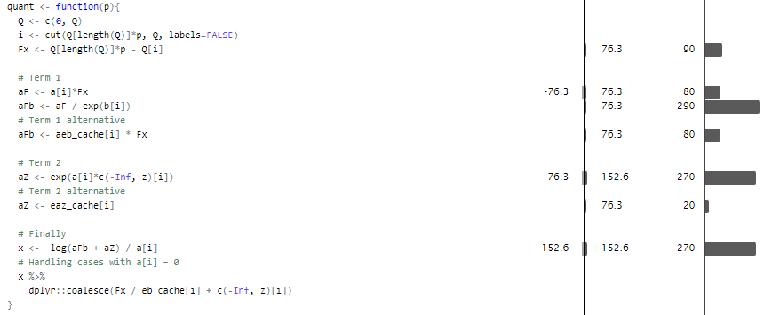

```{r Knitr setup, include = FALSE}
knitr::opts_chunk$set(
  collapse = TRUE,
  comment = "#>"
)
```

```{r, include=FALSE}
source("C:/Users/Jakob/OneDrive - University of Copenhagen/Universitetet/Forsikringsmatematik/År 5/CompStat/CompStat/R/poisson_density.R")
source("C:/Users/Jakob/OneDrive - University of Copenhagen/Universitetet/Forsikringsmatematik/År 5/CompStat/CompStat/R/loglinear_envelope.R")
source("C:/Users/Jakob/OneDrive - University of Copenhagen/Universitetet/Forsikringsmatematik/År 5/CompStat/CompStat/R/rejections_sampler.R")
source('C:/Users/Jakob/OneDrive - University of Copenhagen/Universitetet/Forsikringsmatematik/År 5/CompStat/CompStat/R/Assignment 2 source.R')
```

```{r, include = FALSE}
Poisson <- read_csv("C:/Users/Jakob/OneDrive - University of Copenhagen/Universitetet/Forsikringsmatematik/År 5/CompStat/Data/2_Poisson.csv", 
    col_types = cols(z = col_integer()))
poisson <- Poisson
```

```{r Packages}
library(CompStat)
library(tidyverse)
library(purrr)
library(profvis)
```

# Introduction
This vignette serves as a general rundown of the rejection sampling module. The module builds upon the following central objects:

* RandomVariable - Contains densities, log-densities, and their derivatives.
* Envelope - Subclass of a RandomVariable. Exposes simulation methods and bounding constant $\alpha$.

And the following central functions:

* RandomVariable() - Instantiation of a RandomVariable.
* GaussianEnvelope() - Instantiation and fit of a Gaussian Envelope.
* LogLinearEnvelope() - Instantiation and fit of a Log-Linear Envelope.
* rejection_sampler_factory() - Creates rejection_samplers from envelopes.

# Individual Component Implementation
## GaussianEnvelope()
First step is to implement the given proportionality-expression of the density of
$$
f(y) \propto \Pi_{i=1}^{100}\exp\left(yz_ix_i-e^{yx_i}\right),\:\:\:\:\:\: y\geq 0
$$
Due to the fact, that it is data-dependent and uses the exponential expression we expect this one to be noticeably timeconsuming, and we therefore start by three different implementation strategies of which we will continue using the fastest

```{r, eval=FALSE}
rejec_dens1 <- Vectorize(function(y, data=Poisson){
  x <- data$x
  z <- data$z
  prod(exp(y*z*x-exp(y*x)))
})

rejec_dens3 <- Vectorize(function(y){
  xy <- y * poisson$x
  prod(exp(xy * poisson$z - exp(xy)))
})

rejec_dens5 <- function(y){
  term1 <- y*sum(poisson$x * poisson$z)
  term2 <- rowSums(exp(outer(y, poisson$x)))
  exp(term1 - term2)
}
```

And we compare their speeds using benchmark
```{r}
step <- seq(0, 1, 0.001)
results <- microbenchmark::microbenchmark(
  rejec_dens1(step), 
  rejec_dens3(step), 
  rejec_dens5(step)
  )

results
autoplot(results)
```
And the conclussion is clear: rejec_dens5 is the fastests, which is not surpricing due to the fact, that R truely likes matrix- and vectoroperations.

Having a function for the target-function we would like to get an idea of its behavior, which is why we plot it below. The values taken by this function comes as a monster in the dark on a scale of $10^{-42$. However we also note, that all interesting behavior is in the area $x\in(0,0.5)$
We also note, that it could seem proportional to a gaussian distribution with an incredibly low standard deviation, so implementing rejection sampling from a distribution with density $f$ using a gaussian envelope does not intuitively seem off.

```{r}
input = data.frame(x = seq(0, 1, length.out = 50))
ggplot(input, aes(x)) +
  # stat_function(fun = function(x) dnorm(x, mean = 0.24, sd=0.1)*(1e-40), color = "red") + 
  stat_function(fun = function(x) rejec_dens5(x), color = "blue") +
  labs(x = "x", y = "Density") + 
  theme_classic()
```


Let 
$$
q(y)=\Pi_{i=1}^{100}\exp\left(yz_ix_i-e^{yx_i}\right),\:\:\:\:\:\: y\geq 0
$$
and
$$
p(y)=e^{-\frac{1}{2}(y-\mu)^2},\:\:\:y\in\mathbb{R}
$$
Then $f(x)\propto q(x)$ and $\phi(x-\mu)\propto p(x)$ for $\phi$ denoting the density of a standard normal distribution.

When doing rejection sampling one should always make sure, that for a function $g(X)$ the following holds

* We can sample from the "distribution"
* $g(x) = 0\rightarrow f(x) = 0
* $g(x)$ has finite integral

However, this is obviously so for the gaussian density, hence also for $p$

Since we can find no analytical infimum of the quantity $\frac{p(y)}{q(y)]}=e^{-\frac{1}{2}y^2-\left(\sum_{i=1}^{100}yz_ix_i-e^{x_iy}\right)}$ we tends towards a data-dependent $\alpha '$. Here a true optimizer in R like optim could be used, but we went with a more primitive approach of just taking the minimum over the interval $x\in\[0,5\]$. The reason for this interval is that we have seen, that nothing of interest happens outside of the interval $x\in\[0,0.5\]$.


```{r, eval=FALSE}
sekvens <- seq(0,0.5,length.out=50)
out <- sapply(sekvens, function(x) rejec_dens5(x))
mu <- function(a, b, n){
  sekvens <- seq(a,b,length.out=n)
  out <- sapply(sekvens, function(x) rejec_dens5(x))
  sekvens[which.max(out)]
}
p <- function(y){
  mu <- mu(0,0.5,500)
  exp(-0.5*(y-mu)^2) #mu=0.24 is the maksimum value of the "density"
}
q <- function(x) rejec_dens5(x)
alpha_prime <- min(sapply(sekvens, function(y) p(y)/q(y)))

```
```{r}
mu(0,0.5,500)
alpha_prime
```

The below plot shows, that $\frac{p(y)}{\alpha '} > q(y)$ in the areas of interest. However we do note, that the hardcoded $sd=1$ in the gaussian distribution might benefit from an optimization.


```{r plot: Envelope vs density}
input = data.frame(x = seq(-10, 10, length.out = 1000))
ggplot(input, aes(x)) +
  stat_function(fun = function(x) p(x)/alpha_prime, color = "red") + 
  stat_function(fun = function(x) rejec_dens5(x), color = "blue") +
  labs(x = "x", y = "Density") + xlim(0,1) +
  theme_classic()
```

We implement our rejection sampler as follows


```{r Rejection sampler based on Gaussian envelope, file = 'C:/Users/Jakob/OneDrive - University of Copenhagen/Universitetet/Forsikringsmatematik/År 5/CompStat/CompStat/R/rejections_sampler.R'}
reject_sampler = function(n, rProposal = rnorm, dProposal = p, dTarget = q) {
  result = numeric(n)
  mu <- mu(0,0.5,50)
  for(i in 1:n) {
    U = 1
    ratio = 0
    while(U > ratio) {
      U = runif(1)
      Y = rProposal(1,mean=mu)
      ratio = alpha_prime * dTarget(Y) / dProposal(Y)
    }
    result[i] = Y
  }
  result
}
data <- reject_sampler(1000)

```

And as a visually control we consider the histogram of our simulated data against $q(x)\cdot 8\alpha '$. We are looking for proportionality between the simulated distrubution and the given porportional-density. Multiplication by 7 is chosen to make this proportionality clear.

```{r Sanity plot: Simulated histogram'}
dat.plot = data.frame(x = data)
ggplot(dat.plot, aes(x = x)) +
  geom_histogram(aes(y = ..density..), bins = 20, col = 'black', fill = 'white') +
  stat_function(fun = function(x) rejec_dens5(x)*alpha_prime*7, color = "red") +
  labs(x = "X", y = "Density") +
  theme_classic()
```
### Profiling and benchmarking
This rejection sampler is rather slow, so the next aim is to optimize.

```{r}
profvis(reject_sampler(1000))
```

The function *mu* takes a lot of time as well as the *rejec_dens5*. Assumably, the problem is the *rejec_dens5*, howeber there also is a sapply function in *mu* which knowingly can be optimized using Rcpp.

```{r, include=FALSE}
 Rcpp::sourceCpp("C:/Users/Jakob/OneDrive - University of Copenhagen/Universitetet/Forsikringsmatematik/År 5/CompStat/C++ scripts/Sapply_cpp.cpp")

mu_opt <- function(a, b, n){
  sekvens <- seq(a,b,length.out=n)
  out <- sapply_cpp(sekvens, function(x) rejec_dens5(x))
  sekvens[which.max(out)]
}

(bench <- microbenchmark::microbenchmark(mu(0,0.5,50), mu_opt(0,0.5,50)))
autoplot(bench)

```
```{r Optimizec Rejection Sampling, eval=FALSE}
Rcpp::sourceCpp("C:/Users/Jakob/OneDrive - University of Copenhagen/Universitetet/Forsikringsmatematik/År 5/CompStat/C++ scripts/Sapply_cpp.cpp")

mu_opt <- function(a, b, n){
  sekvens <- seq(a,b,length.out=n)
  out <- sapply_cpp(sekvens, function(x) rejec_dens5(x))
  sekvens[which.max(out)]
}
p_opt <- function(y){
  mu <- mu_opt(0,0.5,50)
  exp(-0.5*(y-mu)^2) #mu=0.24 is the maksimum value of the "density"
}

alpha_prime_opt <- min(sapply_cpp(sekvens, function(y) p(y)/q(y)))

ratio_vec <- c(0)

reject_sampler_opt = function(n, rProposal = rnorm, dProposal = p_opt, dTarget = q, trace = FALSE) {
  count <- 0
  result = numeric(n)
  mu <- mu_opt(0,0.5,50)
  for(i in 1:n) {
    U <- 1
    ratio <- 0
    while(U > ratio) {
      count <- count + 1
      U <- runif(1)
      Y <- rProposal(1,mean=mu)
      ratio <- alpha_prime_opt * dTarget(Y) / dProposal(Y)
      ratio_vec <<- append(ratio_vec, ratio)
    }
    result[i] <- Y
  }
  if(trace){
    cat("Rejection frequency =", (count-n)/count, "\n")
  }
  result
}
```
```{r}
data1 <- reject_sampler(100)
data2 <- reject_sampler_opt(100)


(bench <- microbenchmark::microbenchmark(reject_sampler_opt(100), reject_sampler(100)))

autoplot(bench)
```
It helped, and the optimized version is now a bit faster. However this is only a very tiny bit, and doing another profvis it is clear, that it is the *rejec_dens5* which are the big trouble maker.
Optimizing *rejec_dens5* has proven to be quite a challenge, and therefore we instead tries to collect some low haning fruits by samling Random Variables as a vector once instead of individually. This will introduce some bookeeping, since we do not upfront know have many variables to simulate, but it can be handled by a generic wrapper building on the use of function factories in R:


```{r, eval=FALSE}
fkt_stream <- function(m, fkt, ...) {
  args <- list(...)
  cache <- do.call(fkt, c(m, args)) # Calls the function with n=m and arguments at told. E.g. ... could be mean and sd for fkt=rnorm
  j <- 0
  fact <- 1
  next_rn <- function(r = m) {
    j <<- j + 1
    if(j > m) {                     # When all the generated RVs are used we generates new ones.
      if(fact == 1 && r < m) fact <<- m / (m - r)
      m <<- floor(fact * (r + 1))
      cache <<- do.call(fkt, c(m, args))
      j <<- 1
    }
    cache[j]                        # The fkt_stream function reterns the jth element of the RV vector
  }
  next_rn
}
```


```{r, eval=FALSE}

reject_sampler_opt2 = function(n, rProposal = rnorm, dProposal = p_opt, dTarget = q, trace = FALSE) {
  count <- 0
  result = numeric(n)
  mu <- mu_opt(0,0.5,50)
  
  #Samling the random variables
  U <- fkt_stream(m=n, fkt=runif)
  Y <- fkt_stream(m=n, rProposal, mean=mu)
  
  for(i in 1:n) {
    reject <- TRUE
    while(reject) {
      count <- count + 1
      y <- Y(n-i)
      ratio <- alpha_prime_opt * dTarget(y) / dProposal(y)
      reject <- (U(n-i) > ratio)
      ratio_vec <<- append(ratio_vec, ratio)
    }
    result[i] <- y
  }
  if(trace){
    cat("Rejection frequency =", (count-n)/count, "\n")
  }
  result
}
```

Before benchmarking this new implementation againt the original and optimized one, it is convenient to test whether we are still simulating from the desired distribution:

```{r}
data3 <- reject_sampler_opt2(n=1000, trace = TRUE)

dat.plot = data.frame(x = data3)
ggplot(dat.plot, aes(x = x)) +
  geom_histogram(aes(y = ..density..), bins = 20, col = 'black', fill = 'white') +
  stat_function(fun = function(x) rejec_dens5(x)*alpha_prime*8, color = "red") +
  labs(x = "X", y = "Density") +
  theme_classic()
```
It looks as expected, so we everything is good!


```{r}
(bench2 <- microbenchmark::microbenchmark(reject_sampler_opt(100), reject_sampler_opt2(100)))

autoplot(bench2)
```
As expected we see a small change in the favour of *reject_sampler_opt2*, however, it might just be a coincidence sinde the median is actually performing better for the *reject_sampler_opt*. It therefore is not clear which one to chose for further investigations. No matter the case we will not do any more for now. We have a rejection frequency of 94%, which we really much would like to lower. Therefore we turn to adaptive rejection with a loglinear envelope instead.

## LogLinearEnvelope
The *LogLinearEnvelope* function takes the following arguments:

* A RandomVariable - For which the envelope should be constructed.
* A list of values - Used for choosing the envelope discontinuities. Defaults to 2 automatically chosen points.

The desired functionality requires first and foremost two things:

* Fast simulation from the envelope, since simulations from the envelope form the basis for rejection sampling.
* Fast evaluation, since we need to evaluate the expression
$$
\alpha\frac{f_{input}(Y)}{f_{enve}(Y)}
$$
a large number of times to decide if we accept or reject.

For illustrations, we will use the following envelope for a Gaussian distribution:

```{r}
source("C:/Users/Jakob/OneDrive - University of Copenhagen/Universitetet/Forsikringsmatematik/År 5/CompStat/CompStat/R/poisson_density.R")
source("C:/Users/Jakob/OneDrive - University of Copenhagen/Universitetet/Forsikringsmatematik/År 5/CompStat/CompStat/R/loglinear_envelope.R")
source("C:/Users/Jakob/OneDrive - University of Copenhagen/Universitetet/Forsikringsmatematik/År 5/CompStat/CompStat/R/rejections_sampler.R")
```


```{r Defining an envelope for quantile profiling, fig.width=7, fig.height=3}
enve <- LogLinearEnvelope(get_rv("n"), c(-3, -1, 0, 1, 3))
plot(enve)
```

## Simulation
This is achieved by using the inverse quantile transform quantile transform, for which we need to compute the quantile function.

Generally, this boils down to the problem of solving the equation
$$
F_i(x) = cq - Q_{i-1}
$$
where
$$
F_i(x) = \frac{1}{a_i}e^{b_i}(e^{a_ix} - e^{a_iz_{i-1}})
$$
Solving this equation for $x$ yields
$$
x = \frac{\log\left(\frac{a_iF_i(x)}{e^{b_i}} + e^{a_iz_i}\right)}{a_i}
$$
This calculation is the bottleneck for the simulation. The operations are all rather elementary, so they are hard to improve. Hence the trick is to reduce the number of times they should be performed.

Note that the above process calculation can be performed with input $(a, b, z, F)$ or with input $\left(\frac{a}{e^b}, e^{az}, a, F\right) = (p, q, a, F)$, in this case reducing to
$$
x = \frac{\log(pF + q)}{a}
$$
Thus reducing the need to compute the two exponentiations within each call. This leads to large speedup as show in the profiling window below:

```{r Profiling Quantile Function Implementation, eval = F}
set.seed(0)
U <- runif(1e7)
set.seed(NULL)
profile <- profvis::profvis(
  enve$quant(U)
)
htmlwidgets::saveWidget(profile, "quantile_profile.html")
```
{#id .class width=700px }
## Evaluation
Evaluation is rather straightforward and very fast in general - All we must do is compute
$$
f(x) = \exp(a_ix + b_i)
$$
for the appropriate $a,b$. The bottleneck of this operation is rather the exponentiation, hence we allow for the envelope to return instead the log-density for further operations that can work with this directly.

```{r Benchmark Evaluations, cache=TRUE, fig.width=7, fig.height=3}
f <- enve$f
log_f <- enve$log_f
z <- seq(8, 18)
set.seed(0)
x <- z %>% purrr::map(.f=function(z){
  rnorm(2^z)
})
set.seed(NULL)
calls_f <- seq_along(x) %>% 
  purrr::map(.f=function(i){
    call("f", x[[i]])
  })
calls_log_f <- seq_along(x) %>% 
  purrr::map(.f=function(i){
    call("log_f", x[[i]])
  })
names(calls_f) <- paste0(c("f"), 2^z)
names(calls_log_f) <- paste0(c("log_f"), 2^z)
all_calls <- c(calls_f, calls_log_f)
fvlogfbm <- microbenchmark::microbenchmark(
  list=all_calls
)
fvlogfbm %>% autoplot()
```
```{r Plot Evaluation Benchmark, fig.width=7, fig.height=3}
intermediate <- fvlogfbm %>%
  as.data.frame() %>% 
  as.tibble() %>% 
  group_by(expr) %>% 
  summarise(med_time = median(time)) %>%
  mutate(nsamples = str_extract(expr %>% as.character(), "[0-9]+") %>% as.numeric(),
         what = str_extract(expr %>% as.character(), "[^0-9]+") %>% as.factor()
  )

intermediate %>% 
  ggplot(aes(x = log(nsamples), y = log(med_time), color = what)) +
  geom_line() +
  labs(x = "Log(Evaluation)", y = "Log(Median Time)")
```

# rejection_sampler_factory
Clearly the naive method of rejection sampling is simulating one random variable at a time. We implemented this approach at first, but it is horribly slow and not particularly interesting.

For a more competitive implementation, we have *rejection_sampler_factory*, which is a function-factory producing a rejection samplers given an envelope.

## Evalmode
Apart from the envelope, *rejection_sampler_factory* also takes an argument *evalmode*. This defaults to 0, but 1 and 2 are also possible. These arguments decide how the rejection sampling process should be carried out.

For *evalmode* set to 0, standard rejection sampling is performed using the formula
$$
U \leq \alpha \frac{f_{input}(Y)}{f_{enve}(Y)}
$$
for the acceptance/rejection step.

If *evalmode* is 1, we instead perform the acceptance on log-scale. This is hypothesized to be slightly faster, since fewer exponentiations are needed. The formula is
$$
\log(U) \leq \log(\alpha) + \log(f_{input}(Y)) - \log(f_{enve}(Y))
$$
Finally, if *evalmode* is 2, we utilize the fact that $-\log(U) \sim \text{expo}(1)$, hence it is hypothesized to be faster to sample $E$ from an exponential distribution and calculate
$$
-E \leq \log(\alpha) + \log(f_{input}(Y)) - \log(f_{enve}(Y))
$$
for the accept/reject step.

Our hypothesis is supported by the following profile of the implementation.
```{r Profiling different rejection steps, eval = F}
sampler <- rejection_sampler_factory(enve, evalmode = c(0,1,2))
profvis::profvis(
  sampler(1e7)
)
```
{#id .class width=600px}
Note that the results from each *evalmode* are not identical, since they simulate the uniform/exponential random variables separately. Hence the number of rejections will also be slightly different.

## Adaptibility
For LogLinearEnvelopes, we may iteratively improve the envelope coverage by selection additional tangent points for the envelope. This can be done for each sampler produced by *rejection_sampler_factory* if the sampler is used with the *adapt_env* argument set to TRUE.

The question is if this actually improves the sampling speed. This will come down to a trade-off between extra overhead from evaluating a more complex envelope and fewer rejections, since the envelope is tighter. We conjecture that this will mostly improve otherwise poor envelopes.

To demonstrate this point, we create a poor (Laplacian) envelope of a Gaussian density
```{r Envelope with few tangent points, fig.width=7, fig.height=3}
enve_few <- LogLinearEnvelope(get_rv("n"))
sampler_few <- rejection_sampler_factory(enve_few, evalmode = 2)
plot(enve_few)
```
And this we compare with the same envelope, but fitted iteratively to the distribution
```{r Envelope with some tangent points, fig.width=7, fig.height=3}
enve_medium <- LogLinearEnvelope(get_rv("n"))
sampler_medium <- rejection_sampler_factory(enve_medium, evalmode = 2)
set.seed(0)
for (i in 1:15){
  sampler_medium(1e5, adapt_enve = T)
}
set.seed(NULL)
plot(environment(sampler_medium)$enve)
```

```{r Envelope with many tangent points, fig.width=7, fig.height=3}
enve_many <- LogLinearEnvelope(get_rv("n"))
sampler_many <- rejection_sampler_factory(enve_medium, evalmode = 2)
set.seed(0)
for (i in 1:150){
  sampler_many(1e5, adapt_enve = T)
}
set.seed(NULL)
plot(environment(sampler_many)$enve)
```
Now, we perform a benchmark
```{r Adaptive Sampler Benchmark, cache = T}
z <- 8:16
x <- 2^z
calls_few <- seq_along(x) %>% 
  purrr::map(.f=function(i){
    call("sampler_few", x[i])
  })
calls_medium <- seq_along(x) %>% 
  purrr::map(.f=function(i){
    call("sampler_medium", x[i])
  })
calls_many <- seq_along(x) %>% 
  purrr::map(.f=function(i){
    call("sampler_many", x[i])
  })
names(calls_few) <- paste0(c("few"), 2^z)
names(calls_medium) <- paste0(c("medium"), 2^z)
names(calls_many) <- paste0(c("many"), 2^z)
all_calls <- c(calls_few, calls_medium, calls_many)
adaptive_sampler_bm <- microbenchmark::microbenchmark(
  list=all_calls
)
```
And lets do some plots

```{r Autoplot Adaptation Benchmark, fig.width=7, fig.height=3}
adaptive_sampler_bm %>% autoplot()
```

```{r Plot Adaptation Benchmark, fig.width=7, fig.height=3}
intermediate <- adaptive_sampler_bm %>%
  as.data.frame() %>% 
  as.tibble() %>% 
  group_by(expr) %>% 
  summarise(med_time = median(time)) %>%
  mutate(nsamples = str_extract(expr %>% as.character(), "[0-9]+") %>% as.numeric(),
         what = str_extract(expr %>% as.character(), "[^0-9]+") %>% as.factor()
  )

intermediate %>% 
  ggplot(aes(x = log(nsamples), y = log(med_time), color = what)) +
  geom_line() +
  labs(x = "Log(Samples)", y = "Log(Median Time)")
```
The conclusion is that it is certainly possible to improve the rejection sampling efficiency by adapting the envelopes, but one can also over-adapt them. None of this changes the asymptotic growth rate as expected.

# Implementing the target density
For this assignment, we were particularly interested in implementing a rejection sampler for the following un-normalized density:
$$
f(y) \propto \prod_{i=1}^{100} \exp(yx_iz_u - \exp(yx_i))
$$
$$
\log(f(y)) = y\sum_{i=1}^{100} x_iz_i - \sum_{i=1}^{100}e^{yx_i}
$$
$$
\frac{d}{dy}\log(f(y)) = \sum_{i=1}^{100} x_iz_i - \sum_{i=1}^{100}x_ie^{yx_i}
$$
This clearly requires an efficient implementation of the above, hence which we provide through the *poisson_prior_log_f* and *poisson_prior_log_f_prime* - functions. These should be accessed through a RandomVariable by calling *get_rv("p")*.

The following code snippets show how we can use our rejection sampling machinery to sample from this distribution.

First we define the envelope and fit it to the distribution of interest.
```{r Defining an envelope and fitting it}
set.seed(0)
enve <- LogLinearEnvelope(get_rv("p"), tangent_points = c(0.1, 0.8))
plot(enve, grid=seq(0.001, 1, 0.001), logscale = T)
plot(enve, grid=seq(0.001, 1, 0.001), logscale = T, compare = T)
sampler <- rejection_sampler_factory(enve)
tmp <- sampler(1e4, adapt_enve = T)
rm(tmp)
plot(environment(sampler)$enve, grid=seq(0.001, 1, 0.001), logscale = T)
plot(environment(sampler)$enve, grid=seq(0.001, 1, 0.001), logscale = T, compare = T)
set.seed(NULL)
```

After having fitted the distribution, we extract a (large) sample and plot the estimated density versus the true density. This is done on log-scale for easier comparison.
```{r Simulating from the fitted envelope and investigate the fit}
set.seed(0)
sim <- sampler(1e6) # Takes a little while (~30s)
simdens <- density(sim)
plot(simdens$x, simdens$y %>% log())
plot(simdens$x,  enve$base_rv$log_f(simdens$x))
plot(simdens$x, log(simdens$y) - enve$base_rv$log_f(simdens$x), type = "l")
set.seed(NULL)
```

Trying to implement an approximation of the target density.
```{r}
set.seed(0)
enve_approx <- LogLinearEnvelope(get_rv("a"), tangent_points = c(0.1, 0.8))
plot(enve_approx, grid=seq(0.001, 1, 0.001), logscale = T)
plot(enve_approx, grid=seq(0.001, 1, 0.001), logscale = T, compare = T)
sampler_approx <- rejection_sampler_factory(enve_approx)
tmp <- sampler_approx(1e4, adapt_enve = T)
rm(tmp)
plot(environment(sampler_approx)$enve, grid=seq(0.001, 1, 0.001), logscale = T)
plot(environment(sampler_approx)$enve, grid=seq(0.001, 1, 0.001), logscale = T, compare = T)
set.seed(NULL)
```

```{r}
z <- seq(8, 16)
set.seed(0)
set.seed(NULL)
calls_sampler <- seq_along(x) %>% 
  purrr::map(.f=function(i){
    call("sampler", 2^z[i])
  })
calls_sampler_approx <- seq_along(x) %>% 
  purrr::map(.f=function(i){
    call("sampler_approx", 2^z[i])
  })
names(calls_sampler) <- paste0(c("ordinary"), 2^z)
names(calls_sampler_approx) <- paste0(c("approx"), 2^z)
all_calls <- c(calls_sampler, calls_sampler_approx)
samplerdiff <- microbenchmark::microbenchmark(
  list=all_calls
)
```

```{r}
intermediate <- samplerdiff %>%
  as.data.frame() %>% 
  tibble() %>% 
  group_by(expr) %>% 
  summarise(med_time = median(time)) %>%
  mutate(nsamples = str_extract(expr %>% as.character(), "[0-9]+") %>% as.numeric(),
         what = str_extract(expr %>% as.character(), "[^0-9]+") %>% as.factor()
  )

intermediate %>% 
  ggplot(aes(x = log(nsamples), y = log(med_time), color = what)) +
  geom_line() +
  labs(x = "Log(Samples)", y = "Log(Median Time)")
```


