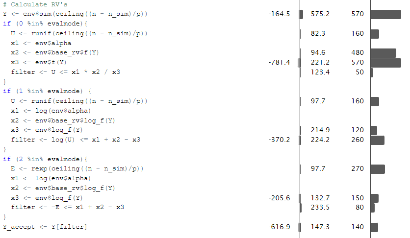

```{r Knitr setup, include = FALSE}
knitr::opts_chunk$set(
  collapse = TRUE,
  comment = "#>"
)
```

```{r Packages}
library(CompStat)
library(tidyverse)
```

# Introduction
This vignette serves as a general rundown of the rejection sampling module. The module builds upon the following central objects:

* RandomVariable - Contains densities, log-densities, and their derivatives.
* Envelope - Subclass of a RandomVariable. Exposes simulation methods and bounding constant $\alpha$.

And the following central functions:

* RandomVariable() - Instantiation of a RandomVariable.
* GaussianEnvelope() - Instantiation and fit of a Gaussian Envelope.
* LogLinearEnvelope() - Instantiation and fit of a Log-Linear Envelope.
* rejection_sampler_factory() - Creates rejection_samplers from envelopes.

# Individual Component Implementation
## GaussianEnvelope()
THIS ONE IS NOT DONE YET.

## LogLinearEnvelope
The *LogLinearEnvelope* function takes the following arguments:

* A RandomVariable - For which the envelope should be constructed.
* A list of values - Used for choosing the envelope discontinuities. Defaults to 2 automatically chosen points.

The desired functionality requires first and foremost two things:

* Fast simulation from the envelope, since simulations from the envelope form the basis for rejection sampling.
* Fast evaluation, since we need to evaluate the expression
$$
\alpha\frac{f_{input}(Y)}{f_{enve}(Y)}
$$
a large number of times to decide if we accept or reject.

For illustrations, we will use the following envelope for a Gaussian distribution:
```{r Defining an envelope for quantile profiling, fig.width=7, fig.height=3}
enve <- LogLinearEnvelope(get_rv("n"), c(-3, -1, 0, 1, 3))
plot(enve)
```

## Simulation
This is achieved by using the inverse quantile transform quantile transform, for which we need to compute the quantile function.

Generally, this boils down to the problem of solving the equation
$$
F_i(x) = cq - Q_{i-1}
$$
where
$$
F_i(x) = \frac{1}{a_i}e^{b_i}(e^{a_ix} - e^{a_iz_{i-1}})
$$
Solving this equation for $x$ yields
$$
x = \frac{\log\left(\frac{a_iF_i(x)}{e^{b_i}} + e^{a_iz_i}\right)}{a_i}
$$
This calculation is the bottleneck for the simulation. The operations are all rather elementary, so they are hard to improve. Hence the trick is to reduce the number of times they should be performed.

Note that the above process calculation can be performed with input $(a, b, z, F)$ or with input $\left(\frac{a}{e^b}, e^{az}, a, F\right) = (p, q, a, F)$, in this case reducing to
$$
x = \frac{\log(pF + q)}{a}
$$
Thus reducing the need to compute the two exponentiations within each call. This leads to large speedup as show in the profiling window below:

```{r Profiling Quantile Function Implementation, eval = F}
set.seed(0)
U <- runif(1e7)
set.seed(NULL)
profile <- profvis::profvis(
  enve$quant(U)
)
htmlwidgets::saveWidget(profile, "quantile_profile.html")
```
{#id .class width=700px }
## Evaluation
Evaluation is rather straightforward and very fast in general - All we must do is compute
$$
f(x) = \exp(a_ix + b_i)
$$
for the appropriate $a,b$. The bottleneck of this operation is rather the exponentiation, hence we allow for the envelope to return instead the log-density for further operations that can work with this directly.

```{r Benchmark Evaluations, cache=TRUE, fig.width=7, fig.height=3}
f <- enve$f
log_f <- enve$log_f
z <- seq(8, 18)
set.seed(0)
x <- z %>% purrr::map(.f=function(z){
  rnorm(2^z)
})
set.seed(NULL)
calls_f <- seq_along(x) %>% 
  purrr::map(.f=function(i){
    call("f", x[[i]])
  })
calls_log_f <- seq_along(x) %>% 
  purrr::map(.f=function(i){
    call("log_f", x[[i]])
  })
names(calls_f) <- paste0(c("f"), 2^z)
names(calls_log_f) <- paste0(c("log_f"), 2^z)
all_calls <- c(calls_f, calls_log_f)
fvlogfbm <- microbenchmark::microbenchmark(
  list=all_calls
)
fvlogfbm %>% autoplot()
```
```{r Plot Evaluation Benchmark, fig.width=7, fig.height=3}
intermediate <- fvlogfbm %>%
  as.data.frame() %>% 
  as.tibble() %>% 
  group_by(expr) %>% 
  summarise(med_time = median(time)) %>%
  mutate(nsamples = str_extract(expr %>% as.character(), "[0-9]+") %>% as.numeric(),
         what = str_extract(expr %>% as.character(), "[^0-9]+") %>% as.factor()
  )

intermediate %>% 
  ggplot(aes(x = log(nsamples), y = log(med_time), color = what)) +
  geom_line() +
  labs(x = "Log(Evaluation)", y = "Log(Median Time)")
```

# rejection_sampler_factory
Clearly the naive method of rejection sampling is simulating one random variable at a time. We implemented this approach at first, but it is horribly slow and not particularly interesting.

For a more competitive implementation, we have *rejection_sampler_factory*, which is a function-factory producing a rejection samplers given an envelope.

## Evalmode
Apart from the envelope, *rejection_sampler_factory* also takes an argument *evalmode*. This defaults to 0, but 1 and 2 are also possible. These arguments decide how the rejection sampling process should be carried out.

For *evalmode* set to 0, standard rejection sampling is performed using the formula
$$
U \leq \alpha \frac{f_{input}(Y)}{f_{enve}(Y)}
$$
for the acceptance/rejection step.

If *evalmode* is 1, we instead perform the acceptance on log-scale. This is hypothesized to be slightly faster, since fewer exponentiations are needed. The formula is
$$
\log(U) \leq \log(\alpha) + \log(f_{input}(Y)) - \log(f_{enve}(Y))
$$
Finally, if *evalmode* is 2, we utilize the fact that $-\log(U) \sim \text{expo}(1)$, hence it is hypothesized to be faster to sample $E$ from an exponential distribution and calculate
$$
-E \leq \log(\alpha) + \log(f_{input}(Y)) - \log(f_{enve}(Y))
$$
for the accept/reject step.

Our hypothesis is supported by the following profile of the implementation.
```{r Profiling different rejection steps, eval = F}
sampler <- rejection_sampler_factory(enve, evalmode = c(0,1,2))
profvis::profvis(
  sampler(1e7)
)
```
{#id .class width=600px}
Note that the results from each *evalmode* are not identical, since they simulate the uniform/exponential random variables separately. Hence the number of rejections will also be slightly different.

## Adaptibility
For LogLinearEnvelopes, we may iteratively improve the envelope coverage by selection additional tangent points for the envelope. This can be done for each sampler produced by *rejection_sampler_factory* if the sampler is used with the *adapt_env* argument set to TRUE.

The question is if this actually improves the sampling speed. This will come down to a trade-off between extra overhead from evaluating a more complex envelope and fewer rejections, since the envelope is tighter. We conjecture that this will mostly improve otherwise poor envelopes.

To demonstrate this point, we create a poor (Laplacian) envelope of a Gaussian density
```{r Envelope with few tangent points, fig.width=7, fig.height=3}
enve_few <- LogLinearEnvelope(get_rv("n"))
sampler_few <- rejection_sampler_factory(enve_few, evalmode = 2)
plot(enve_few)
```
And this we compare with the same envelope, but fitted iteratively to the distribution
```{r Envelope with some tangent points, fig.width=7, fig.height=3}
enve_medium <- LogLinearEnvelope(get_rv("n"))
sampler_medium <- rejection_sampler_factory(enve_medium, evalmode = 2)
set.seed(0)
for (i in 1:15){
  sampler_medium(1e5, adapt_enve = T)
}
set.seed(NULL)
plot(environment(sampler_medium)$enve)
```

```{r Envelope with many tangent points, fig.width=7, fig.height=3}
enve_many <- LogLinearEnvelope(get_rv("n"))
sampler_many <- rejection_sampler_factory(enve_medium, evalmode = 2)
set.seed(0)
for (i in 1:150){
  sampler_many(1e5, adapt_enve = T)
}
set.seed(NULL)
plot(environment(sampler_many)$enve)
```
Now, we perform a benchmark
```{r Adaptive Sampler Benchmark, cache = T}
z <- 8:16
x <- 2^z
calls_few <- seq_along(x) %>% 
  purrr::map(.f=function(i){
    call("sampler_few", x[i])
  })
calls_medium <- seq_along(x) %>% 
  purrr::map(.f=function(i){
    call("sampler_medium", x[i])
  })
calls_many <- seq_along(x) %>% 
  purrr::map(.f=function(i){
    call("sampler_many", x[i])
  })
names(calls_few) <- paste0(c("few"), 2^z)
names(calls_medium) <- paste0(c("medium"), 2^z)
names(calls_many) <- paste0(c("many"), 2^z)
all_calls <- c(calls_few, calls_medium, calls_many)
adaptive_sampler_bm <- microbenchmark::microbenchmark(
  list=all_calls
)
```
And lets do some plots

```{r Autoplot Adaptation Benchmark, fig.width=7, fig.height=3}
adaptive_sampler_bm %>% autoplot()
```

```{r Plot Adaptation Benchmark, fig.width=7, fig.height=3}
intermediate <- adaptive_sampler_bm %>%
  as.data.frame() %>% 
  as.tibble() %>% 
  group_by(expr) %>% 
  summarise(med_time = median(time)) %>%
  mutate(nsamples = str_extract(expr %>% as.character(), "[0-9]+") %>% as.numeric(),
         what = str_extract(expr %>% as.character(), "[^0-9]+") %>% as.factor()
  )

intermediate %>% 
  ggplot(aes(x = log(nsamples), y = log(med_time), color = what)) +
  geom_line() +
  labs(x = "Log(Samples)", y = "Log(Median Time)")
```
The conclusion is that it is certainly possible to improve the rejection sampling efficiency by adapting the envelopes, but one can also over-adapt them. None of this changes the asymptotic growth rate as expected.

# Implementing the target density
For this assignment, we were particularly interested in implementing a rejection sampler for the following un-normalized density:
$$
f(y) \propto \prod_{i=1}^{100} \exp(yx_iz_u - \exp(yx_i))
$$
$$
\log(f(y)) = y\sum_{i=1}^{100} x_iz_i - \sum_{i=1}^{100}e^{yx_i}
$$
$$
\frac{d}{dy}\log(f(y)) = \sum_{i=1}^{100} x_iz_i - \sum_{i=1}^{100}x_ie^{yx_i}
$$
This clearly requires an efficient implementation of the above, hence which we provide through the *poisson_prior_log_f* and *poisson_prior_log_f_prime* - functions. These should be accessed through a RandomVariable by calling *get_rv("p")*.

The following code snippets show how we can use our rejection sampling machinery to sample from this distribution.

First we define the envelope and fit it to the distribution of interest.
```{r Defining an envelope and fitting it}
set.seed(0)
enve <- LogLinearEnvelope(get_rv("p"), tangent_points = c(0.1, 0.8))
plot(enve, grid=seq(0.001, 1, 0.001), logscale = T)
plot(enve, grid=seq(0.001, 1, 0.001), logscale = T, compare = T)
sampler <- rejection_sampler_factory(enve)
tmp <- sampler(1e4, adapt_enve = T)
rm(tmp)
plot(environment(sampler)$enve, grid=seq(0.001, 1, 0.001), logscale = T)
plot(environment(sampler)$enve, grid=seq(0.001, 1, 0.001), logscale = T, compare = T)
set.seed(NULL)
```

After having fitted the distribution, we extract a (large) sample and plot the estimated density versus the true density. This is done on log-scale for easier comparison.
```{r Simulating from the fitted envelope and investigate the fit}
set.seed(0)
sim <- sampler(1e6) # Takes a little while (~30s)
simdens <- density(sim)
plot(simdens$x, simdens$y %>% log())
plot(simdens$x,  enve$base_rv$log_f(simdens$x))
plot(simdens$x, log(simdens$y) - enve$base_rv$log_f(simdens$x), type = "l")
set.seed(NULL)
```

Trying to implement an approximation of the target density.
```{r}
set.seed(0)
enve_approx <- LogLinearEnvelope(get_rv("a"), tangent_points = c(0.1, 0.8))
plot(enve_approx, grid=seq(0.001, 1, 0.001), logscale = T)
plot(enve_approx, grid=seq(0.001, 1, 0.001), logscale = T, compare = T)
sampler_approx <- rejection_sampler_factory(enve_approx)
tmp <- sampler_approx(1e4, adapt_enve = T)
rm(tmp)
plot(environment(sampler_approx)$enve, grid=seq(0.001, 1, 0.001), logscale = T)
plot(environment(sampler_approx)$enve, grid=seq(0.001, 1, 0.001), logscale = T, compare = T)
set.seed(NULL)
```

```{r}
z <- seq(8, 16)
set.seed(0)
set.seed(NULL)
calls_sampler <- seq_along(x) %>% 
  purrr::map(.f=function(i){
    call("sampler", 2^z[i])
  })
calls_sampler_approx <- seq_along(x) %>% 
  purrr::map(.f=function(i){
    call("sampler_approx", 2^z[i])
  })
names(calls_sampler) <- paste0(c("ordinary"), 2^z)
names(calls_sampler_approx) <- paste0(c("approx"), 2^z)
all_calls <- c(calls_sampler, calls_sampler_approx)
samplerdiff <- microbenchmark::microbenchmark(
  list=all_calls
)
```

```{r}
intermediate <- samplerdiff %>%
  as.data.frame() %>% 
  tibble() %>% 
  group_by(expr) %>% 
  summarise(med_time = median(time)) %>%
  mutate(nsamples = str_extract(expr %>% as.character(), "[0-9]+") %>% as.numeric(),
         what = str_extract(expr %>% as.character(), "[^0-9]+") %>% as.factor()
  )

intermediate %>% 
  ggplot(aes(x = log(nsamples), y = log(med_time), color = what)) +
  geom_line() +
  labs(x = "Log(Samples)", y = "Log(Median Time)")
```


